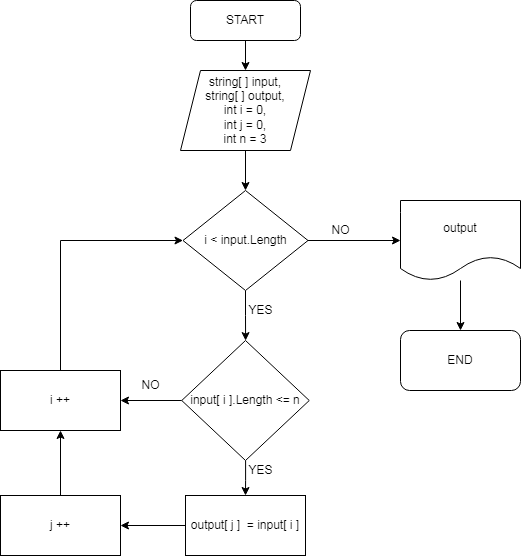

# Итоговая работа по Блоку № 1

## Задача
Написать программу, которая из имеющегося массива строк формирует новый массив из строк, длина которых меньше, либо равна 3 символам. Первоначальный массив можно ввести с клавиатуры, либо задать на старте выполнения алгоритма. При решении не рекомендуется пользоваться коллекциями, лучше обойтись исключительно массивами.

## Алгоритм решения
* Перебираем значения введенного пользователем (исходного) массива.
* Проверяем каждое значение массива на соответствие условию: длинна строки меньше или равна трем (3) символам.
* Если условия выполняются, то данное значение вносим в новый массив.
* Повторяем пункты 2 и 3 до тех пор, пока не достигнем конца исходного массива.
* Возращаем новый заполненый массив как результат.

## Блок-схема алгоритма

